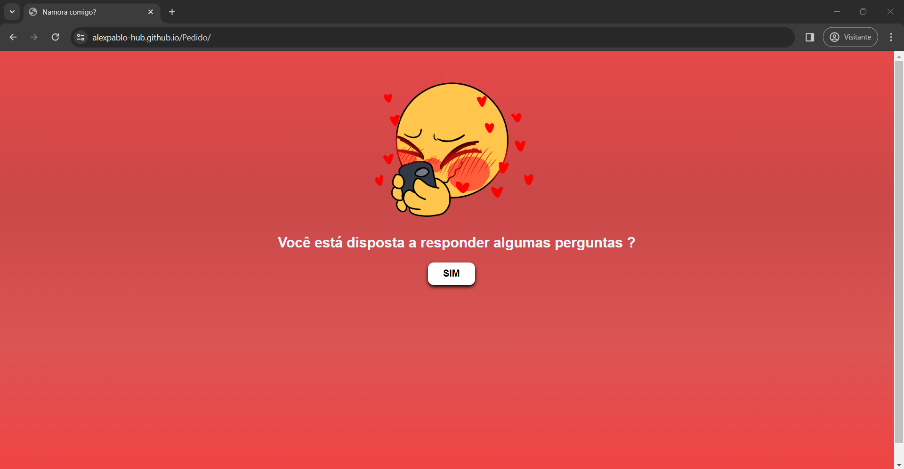
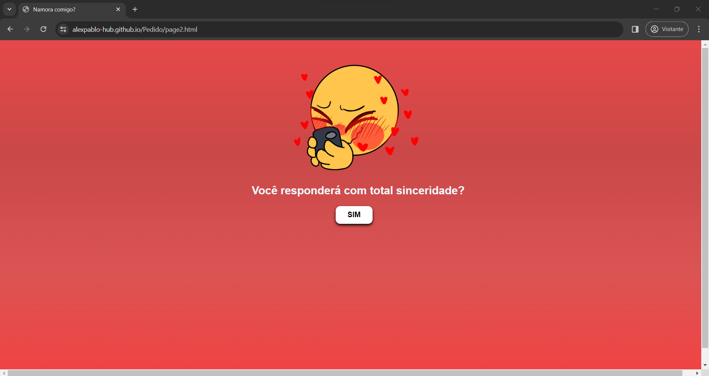
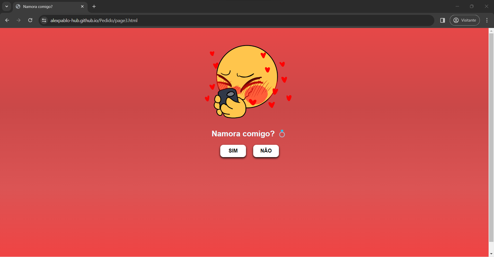

# Pedido de Namoro.
Bem-vindo ao projeto "Pedido de Namoro"! Este é um projeto simples e interativo criado para fazer um pedido de namoro de uma forma única e divertida.

O projeto pode ser acessado aqui, link https://alexpablo-hub.github.io/Pedido/

# Instruções de Uso.
Perguntas Iniciais:
- Responda às perguntas iniciais clicando nos botões "SIM".
- As perguntas serão apresentadas em diferentes páginas.

Pedido:
Após as perguntas, você será levado a uma pagina com a mensagem 'Namora comigo? 💍', Ao clicar em "SIM", uma mensagem de aceitação será exibida.
Caso escolha "NÃO", o botão se moverá pela tela, proporcionando uma interação divertida.

Mensagem Final:
Após aceitar, uma mensagem final será exibida.

# Clonagem do Projeto
Para clonar e executar este projeto localmente, siga as instruções abaixo:

Clone atravez do git clone https://github.com/alexpablo-hub/pedido.git

Navegue até o diretório do projeto
cd 'seu_diretório_aqui'

Abra o arquivo 'index.html' no seu navegador para visualizar o projeto localmente.
ou atravez de um link de exibição que pode ser feito no git.

# Imagens de Demonstração

    
  

## 👨‍💻 Desenvolvedor

Este projeto foi desenvolvido por **Alex Pablo de Oliveira Moraes**. 

Sou estudante de **Sistemas de Informação** na **UNEMAT**, apaixonado por tecnologia, programação e segurança de redes e tecnologias relacionadas ao desenvolvimento backend e segurança da informação.

Você pode me encontrar nas redes sociais ou conferir meus outros projetos no meu perfil [GitHub](https://github.com/AlexPablo-hub).

Se tiver alguma dúvida ou sugestão sobre o projeto, fique à vontade para entrar em contato!

Espero que você aproveite o pedido de namoro interativo e divertido! 💖
